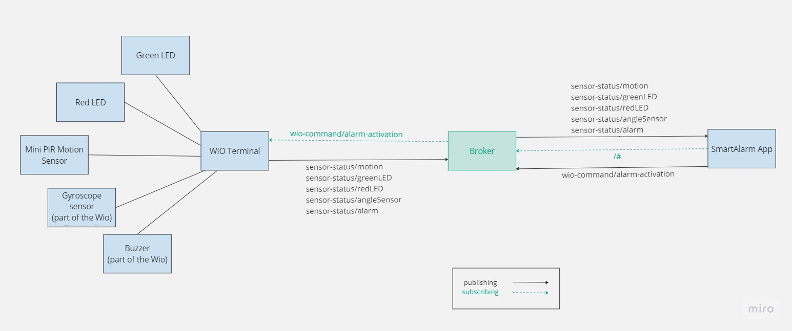

# SmartAlarm [Group #5]

<div align="center">
 
</div>

## What is SmartAlarm?

SmartAlarm is a [student-maintained project](README.md#-project-status) consisting of building a smart alarm system - which encompasses a range of `sensors` and `actuators` - to protect the users’ houses from intrusions. 

The system features a device which can be placed at a substantial spot in the house of the user and it will be enabled by the user in scenarios when either the user is away from their house or in a place where they would like to secure the house and be aware of any possible red signs.

### Main features

<details>
<summary>Intruder detection</summary>

>Whenever an intruder is detected, a red LED will be activated, the speaker will produce an alerting sound and a notification will be sent to a remote device to inform about the danger.

</details>

<details>
<summary>Anti-Tampering protection</summary>

>Detects whether someone is trying to move or damage the device itself by integrating a gyroscope sensor. A red LED and alerting speakers are activated immediately.

</details>

<details>
<summary>Activated device indicator</summary>

>Indicates that the vicinity is protected, signaling the owner and deterring would-be intruders. Uses a green LED.

</details>

<details>
<summary>Connection testing</summary>

>Check if the communication is working as intended, in which case clicking a physical button will allow users to ping the remote device.

</details>


## 🎬 Project demo

[](https://www.youtube.com/watch?v=JawHDH_duKA&ab_channel=MariiaZabolotnia)

---
## 🔨 Pre-setup

### Windows
Download NodeJS
https://nodejs.org/en

### MacOS
same OR 

Install Homebrew https://brew.sh/

```
    /bin/bash -c "$(curl -fsSL https://raw.githubusercontent.com/Homebrew/install/HEAD/install.sh)"
```
Install NodeJS:
```
    brew install node 
```

---

## 🚀 Getting started

```
  -> navigate to the projects folder (ex. cd IdeaProjects)
  git clone git@git.chalmers.se:courses/dit113/2023/group-5/smartalarm.git
  cd smartalarm
  npm install
  npx expo start
```
--- 

## 📃 Documentation

* [Wiki](https://git.chalmers.se/courses/dit113/2023/group-5/smartalarm/-/wikis/home)
* [General Documentation](https://drive.google.com/drive/folders/1s_yNdp31QmD7Ln1M4WMi1G9Pj-dcXLT2?usp=sharing)
* [User Manual](https://docs.google.com/document/d/1bAcS2MCeM9MgyR5oG2jDIKEw0J4wggHbujKBYlBWEz0/edit?usp=sharing)

---


## 🚨 Project status

The SmartAlarm project is currently underway. 

This project is being implemented by students and constitutes a requisite for the course DIT113 (Mini Project: Systems Development) of the Bachelor's Degree in Software Engineering and Management, offered by the University of Gothenburg. 

>**_NOTE:_** No maintenance or further development of this project is expected to occur beyond the duration of the course (i.e. Spring 2023).

---
## 👥 Authors and Acknowledgements

### Contributors

* [Abhimanyu Kumar](https://git.chalmers.se/kumarab)

His personal contribution was primarily a mix of documentation work and coding work, but strongly inclined towards documentation work of the wiki page, articulating sprint deliverables, creating the user manual et cetera, while his coding work revolved around building the security feature of the app and ensuring other minor security measures (mentioned in the user manual).

* [Agrima Singh](https://git.chalmers.se/agrima)

In terms of the app functionalities, her contribution involved implementing the Emergency Contact page in the app which has a feature of sending alerts along with the Advice page in which video was embedded. Further, she also implemented the page which gives details regarding the New Version of our smart alarm.
In terms of project management, she was in charge of managing the Git repository and making sure all the deliverables were being met for each sprint.  She was  responsible for making sure that all commits were traceable. Also, managed the Kanban board, edited descriptions, added appropriate labels and deadlines so that the everything was consistent and adhered to our conventions. 
Moreover, she also detailed the minutes of the meeting after all our internal meetings.
She also conducted a GitLab workshop for members of our team wherein Git commands were explained along with details on features of GitLab and how to make our project more traceable. She created two sub pages: GitLab Guidelines and Commit Message Convention as well. She also helped in filming the final sprint video.

* [David Rocha](https://git.chalmers.se/davidroc)

His contributions involved establishing the MQTT connection between the WIO and the broker, connecting the sensors and the battery to the WIO terminal,  implementing the base sensor/actuator-related features (including PIR motion and angle) and the initial UI for the WIO. He also worked on the multi wi-fi connection capability of the WIO. 
Moreover, he implemented the CICD Pipeline on GitLab and created a Workshop based on it for the other team members. He created a few Jest tests and did configuration adjustments and created a base Webpage React component.
In terms of documentation, he contributed to the wiki page, added issues and requirements and created the initial ReadMe page. He also offered ad-hoc assistance for other team members.

* [Mariia Zabolotnia](https://git.chalmers.se/mariiaz)

Her main responsibility was developing a consistent mobile app and supporting it along the way with new features. She has set up the core of the React Native project, connected navigation between screens, and implemented the bottom navigation bar. 
Also, she implemented the Home page and its card layout and History page that has a feature of synchronizing with real data from the sensors. Additionally, she has put a lot of effort into the documentation and contributed to the GitLab project management tools. This included creating traceable issues according to conventions and editing them with proper labels and acceptance criteria, maintaining them over time. 
She also led the weekly scrum meetings where each of the team members shared his progress, blockers, and questions. Moreover, she conducted the React Native workshop for the team members and added a step-by-step guideline for creating a new feature in our app. Also focused on delivering several demo videos of the project.

* [Milena Maćkowiak](https://git.chalmers.se/milenam)

A few of her responsibilities were creating issues on the GitLab repository and taking part in the set-up. She was in charge of configuration and set-up of the testing environment for the project as well as conducting a workshop, where she introduced testing to the team. 
One of her tasks was also giving some more information about testing in Wiki. She was supposed to implement push notification for the app, which unfortunately turned out to be too complex. Instead, she took care of making the theme of the app was the same as the mode set on a user’s device at a particular moment. 
She also improved the UI of a few screens to make it consistent with the rest of the application.

* [Oana Isabela Mitac](https://git.chalmers.se/mitac)

Her contribution involved establishing the MQTT connection between the app and the broker. She also implemented the Sensors page which contains the real time status of each sensor. Moreover, she implemented a card in the Home page where the user can see the real time status of the alarm and contains 2 buttons for turning the alarm on and off.
Further more, she worked on improving the UI of the WIO terminal. She also contributed to the video demo for Sprint 2 and 3, creating issues on GitLab, creating some requirements, updating the MQTT connection diagram and updating the ReadMe file with the team member's contributions.

>This project is not open to new contributors.

### Technologies used
* Wio Seeed Hardware
* Java
* Expo
* JavaScript
* React Native
* React Native Libraries
  * React Native Navigation
  * React Native Base
  * Expo Icons
* ESLint
* C++
* IntelliJ / Android Studio IDE
* Arduino IDE
* Arduino IDE Libraries
  * Seeed Arduino SFUD
  * PubSubClient
  * Seeed Arduino FS
  * Seeed Arduino rpcUnified
  * Seeed Arduino rpcWiFi
  * Seeed_Arduino_mbedtls
* GitLab
* Google Docs
* Miro
* TinkerCad

## Hardware and Software Architecture
The diagram below shows the connection between our 3 main components: the WIO terminal with the sensors attached to it, the MQTT broker and the remote device used to control the alarm.



The class diagram below shows the main structure of our app:


### Other Attributions

<a href="https://pixabay.com/illustrations/flasher-signal-police-alarm-5027727/
">Alarm icon</a> by <a href="https://pixabay.com/users/alexey_hulsov-388655/?utm_source=link-attribution&amp;utm_medium=referral&amp;utm_campaign=image&amp;utm_content=5027727">Alexey Hulsov</a> from <a href="https://pixabay.com//?utm_source=link-attribution&amp;utm_medium=referral&amp;utm_campaign=image&amp;utm_content=5027727">Pixabay</a>.

<a href="https://www.freepik.com/free-vector/cyber-security-concept_4436009.htm
">Web page background</a> by <a href="https://www.freepik.com/author/rawpixel-com">Rawpixel.com</a> from <a href="https://www.freepik.com/free-vector/cyber-security-concept_4436009.htm#query=security%20background&position=13&from_view=keyword&track=ais">Freepik</a>.
